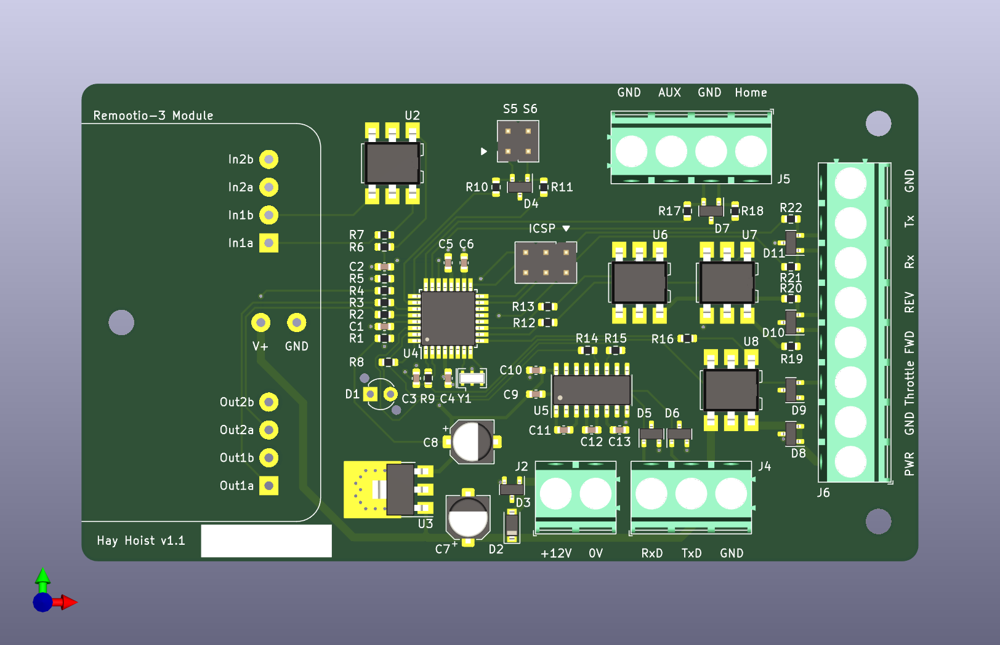
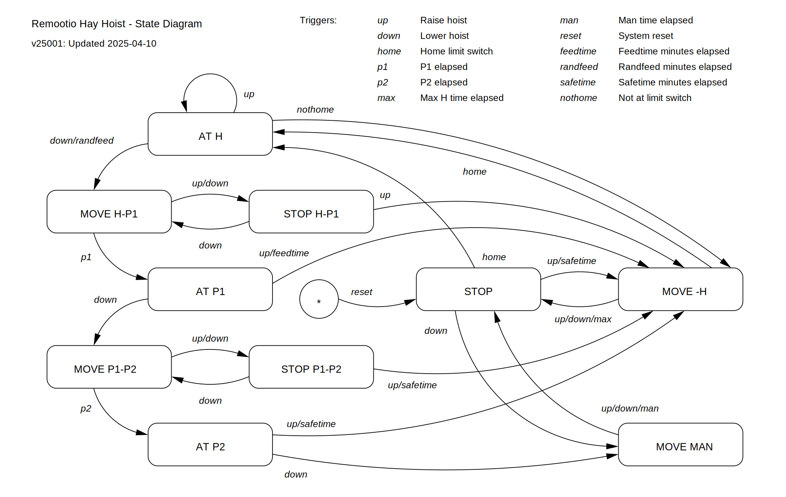
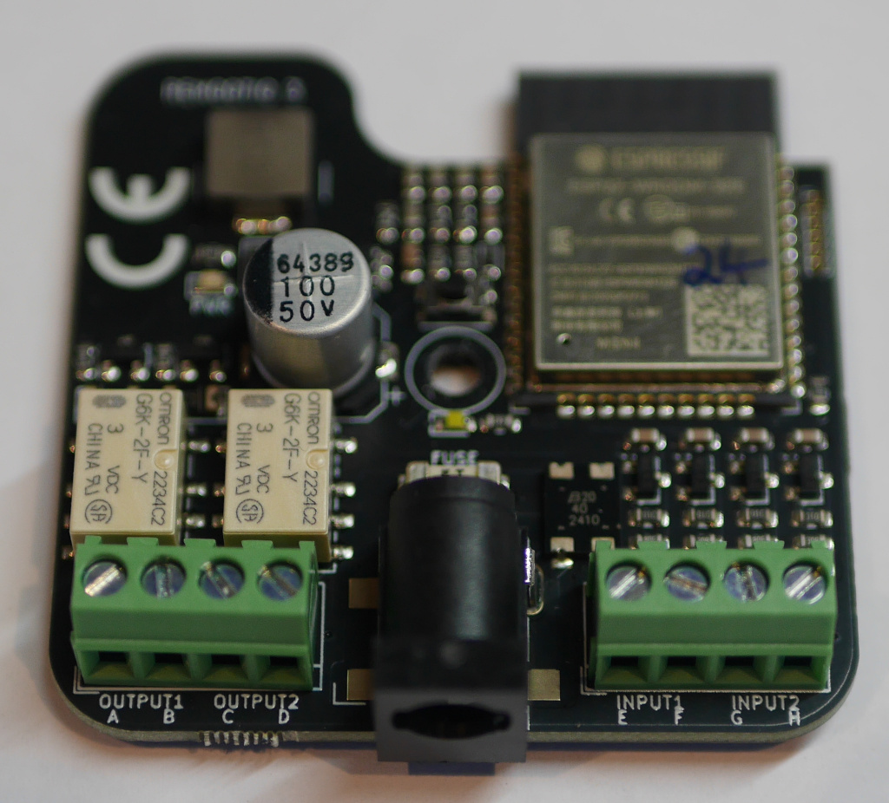

# Remootio Adapter "PLC" - Hay Hoist

Adapt a Remootio door opener remote to
a golf buggy motor controller using an
AVR m328pb for remote control of a hay hoist.

## Operation

### Manual Operation

On reception of "down" command, hoist is lowered to P1 height.
If no further commands are received, it will retract to the home
position after the configured feed time minutes have elapsed.

A further "down" command will lower the hoist to the P2 height.

Return to home position on reception of an "up" signal, or
after a programmable duration without input.

### Scheduled Feeding

If a number of feeds per day is specified, the hoist will lower
from the home position to P1 after a randomly chosen interval,
roughly "feeds/day" times a day.

The hoist will remain at P1 until feed time minutes have elapsed, 
then retract to the home position. Manual operation "down" or
"up" will cancel a pending automatic schedule.

To disable scheduled feeding, manually lower the hoist slightly
from the home position. To re-enable, return hoist to home
("open") position.

### Special Cases

If an error condition is flagged, the hoist will only allow
movement up and down small amounts determined by the "Man time"
setting. To correct an error state, clear the sensor
switch and then manually operate the hoist down slightly and
then up to the home position.

Errors and exceptions may be triggered by the following conditions:

   - Low Battery: Scheduled feeding is suppressed when battery
     voltage falls below 11.8V. In this state, the battery LED
     is illuminated, manual operation is still enabled.
   - Spurious Sensor: In the case of a spurious triggering of
     the home sensor, an error condition is flagged and the
     motor is stopped.
   - Sensor Failure: If the home sensor fails "open", or if the
     state logic is out of sync, the hoist will not react to
     up (raise) commands. If the sensor fails "closed", and max
     H time has elapsed, the hoist will flag an error condition.
   - Safetime: If the hoist is left at position P2, between P1 and P2,
     or in the STOP state, it will attempt to retract automatically
     to the home position after about 30 minutes.
   - Disable Schedule: Scheduled feeding may be temporarily disabled
     by manually lowering the hoist slightly from the home position
     to state "STOP H-P1". To re-enable scheduled feeding, return
     hoist to home position.

### Serial Console

Connect RS-232 serial adapter to J4 (console)
and open a terminal at 19200 baud, 8n1.

Triggers, state changes and errors will
be displayed.

Enter '?' to display available commands:

	Commands:
	        1       H-P1 time (0.01s)
	        2       P1-P2 time
	        m       Man time
	        h       H time
	        f       Feed time (min)
	        n       Feeds/day (0=off)
	        v       Show current values
	        s       Status
	        d       Lower
	        u       Raise

Configuration parameters are adjusted
by entering the command key followed by
an updated value and then enter.
Time values 1,2,m and h are set in units of 0.01s.
Feeding time is in minutes. Throttle
CV is roughly 5.0 * val / 255 Volts.

## Connectors

Adapter | Connector | Description
--- | --- | ---
J1:1 |  | "S5" Auxiliary I/O (unused)
J1:2 |  | "GND"
J1:3 |  | "S6" Auxiliary I/O (unused)
J1:4 |  | "GND"
N/C | C3:B | Motor + (blue)
N/C | C3:C | Motor - (yellow)
J2:1 | C4:D | "+12V" Battery + (red)
J2:2 | C4:A | "0V" Battery - (black)
J3:1 |  | ICSP MISO
J3:2 |  | ICSP VCC
J3:3 |  | ICSP SCK
J3:4 |  | ICSP MOSI
J3:5 |  | ICSP RST
J3:6 |  | ICSP GND
J4:1 | C1:2 | "RxD" Console DCE Received Data
J4:2 | C1:3 | "TxD" Console DCE Transmitted Data
J4:3 | C1:5 | "GND" Console DCE Common Ground
J5:1 | C2:C | "Home" Home Limit Input (NC output)
N/C | C2:B | Short to C2:D
J5:2 | C2:A | "GND" Home Limit Ground
N/C | C2:D | Short to C2:B
J5:3 |  | "AUX" Encoder/Counter Input (unused)
J5:4 |  | "GND" Encoder/Counter Ground
J6:1 | M1:7 | "PWR" Controller power (pink)
J6:2 | M:6,20 | "GND" Controller ground (black)
J6:3 | M:3 | "Throttle" Controller speed (dark green)
J6:4 | M:12 | "FWD" Controller forward (white)
J6:5 | M:14 | "REV" Controller reverse (orange)
J6:6 | M:Rx | "Rx" Controller serial receive (light blue)
J6:7 | M:Tx | "Tx" Controller serial transmit (light green)
J6:8 | M:Gnd | "GND" Controller ground (black)

Notes:

   - J6:4 "FWD" and J6:5 "REV" may need to be swapped
     to match spool rotation.

## Remootio Preparation

Remove remootio from plastic enclosure.

De-solder DC socket and screw terminal blocks.

If DC connector is through-hole type, place a strip of capton tape
over bottom-side pads, and solder 12V link wire to adapter board.
For SMT DC connector version, leave pcb as-is after removal.

Fit module to adapter board and solder pin headers. Add 12V and
GND power supply links. Power on and pair with application.

In the Remootio application:

   - Select output configuration 4: "Output 1 to open, Output 2 to close"
   - Configure both "open" and "close" impulse length to 50ms.
   - Disable background display option
   - Under power settings enable "Low Power Mode" and "Dark Mode"
   - Enable sensor add-on: Input 1

Application interface displays "open" when the hay hoist is
retracted to the home position. The display will show "closed"
when the hoist has been lowered to the feeding position (P1).

## Motor Controller Preparation

Motor controller is configured by firmware at boot time
as necessary according to
[spm_config.bin](reference/spm_config.bin)
and [spm_config.txt](reference/spm_config.txt).

Use [spmtool](https://github.com/ndf-zz/spmtool) to create
a new config if required. Settings match the following in
Kelly Controller software:

### Step 1: General Setting

   - Forward Switch: Enable
   - Foot Switch: Disable
   - Throttle Sensor Type: 0-5V
   - Throttle Effective Starting: 4%
   - Throttle Effective Ending: 96%
   - Max Motor Current: 85%
   - Max Battery Current: 40%

### Step 2: General Setting

   - Start-up Delay: 0 sec
   - Control Mode: Balanced
   - Under voltage: 10V
   - Over Voltage: 20V
   - Throttle Up/Down Rate: 1 (Fast)
   - Power On High Pedal Disable: Disable
   - Releasing Brake High Pedal Disable: Disable

### Step 3: General Setting

   - Motor Top Speed: 100%
   - Boost Function: Disable
   - Economy Function: Disable
   - Half Current in Reverse: Disable
   - ABS: Disable
   - 12V Output: Disable
   - Motor Top Speed in Reverse: 100%
   - Joysticker[sic] Throttle: Disable

### Step 4: Regeneration Setting

   - Regeneration: Disable
   - Brake Switch: Disable
   - Releasing Throttle Starts Regen: Disable
   - Regen Current By Brake Switch On: 5% [unused]
   - Max Regen Current: 20% [unused]
   - Brake Sensor Type: No
   - Brake Sensor Starting Point: 0% [unused]
   - Brake Sensor Ending Point: 100% [unused]

### Step 5: Sensor, CAN, Smooth Setting

   - Motor Temperature Sensor: Disable
   - Controller Stop Output Temperature: 125C
   - Controller Resume Output 90C
   - CAN [empty]
   - Smooth: Disable

## Firmware layout

	Main event loop:	src/main.c: 	main()
	State machine logic:	src/main.c:	update_state()
	Reset/initialisation:	src/system.c:	system_init()
	Serial console logic:	src/console.c:	read_input()
	SPM controller setting:	src/spmcheck.c	spm_check()

## Build

Connect AVR ISP to programming header, program fuses, initialise
the random seed book, then build and upload firmware to MCU:

	$ make fuse
	$ make randbook
	$ make upload

Note: randbook will overwrite any stored configuration, so it should
only be run once when initialising a new unit. Uploading a new
firmware will not overwrite stored configuration.

On boot, the SPM controller will be updated if required. Updates are
reported to the console output:

	Info: Boot v24011
	SPM: Config updated
	Info: Boot v24011
	SPM: 23014810
	Trigger: reset
	State: [STOP] Batt: 0.0V
	Trigger: home
	[...]

## Build Requirements

   - GNU Make
   - gcc-avr
   - binutils-avr
   - avr-libc
   - avrdude
   - python3 (if controller config is edited)

On a Debian system, use make to install required packages:

	$ make requires

## Prototype Unit Reference

   - [wiring diagram](reference/remootio_adapter_protoype_wiring.pdf)
   - [port-pins diagram](reference/remootio_adapter_prototype_portpins.pdf)
   - [schematic diagram](reference/remootio_adapter_prototype_schematic.pdf)

