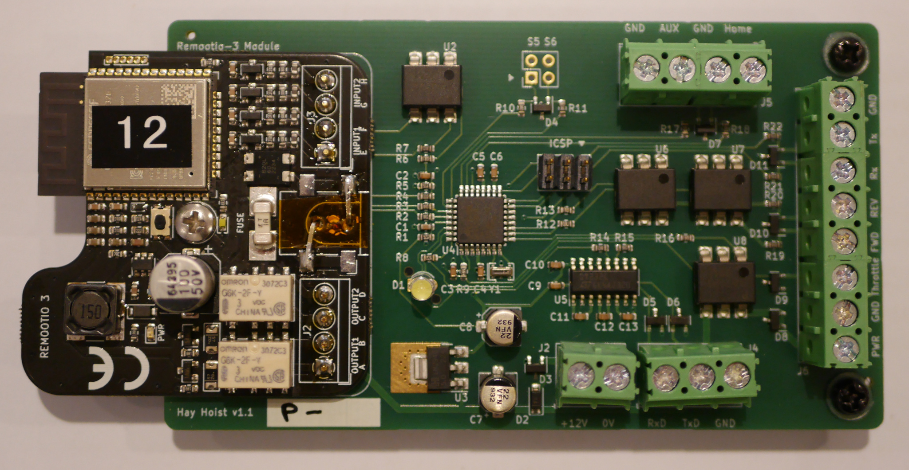

# Assembly Instruction

## Components

   - Remootio Module
   - Main PCB
   - Motor Controller
   - Connectors
   - AC Power Supply

## Remootio Module

Power on Remootio using supplied DC adapter, pair with
application and then setup as follows:

   - Select output configuration 4: "Output 1 to open, Output 2 to close"
   - Configure both "open" and "close" impulse length to 50ms.
   - Disable background display option
   - Under power settings enable "Low Power Mode" and "Dark Mode"
   - Enable sensor add-on: Input 1

Test operation with application, then prepare PCB for use with
adapter:

Remove Remootio from plastic enclosure.

De-solder DC socket and screw terminal blocks.

If DC connector is through-hole type, place a strip of capton tape
over bottom-side pads.
For both variants, place small length of
capton tape over DC jack alignment hole(s) on top side.

Label module with serial number for future reference.

## Main PCB

Inspect PCB for clean solder joints, parts properly located
and finish.

Solder THT parts to PCB:

   - ICSP header J3
   - Screw terminals J2, J4, J5, J6
   - LED D1 with ~4mm standoff from board

Perform the following tests:

   - connect console C1 and 12V
   - connect ICSP
   - power on
   - run burn-in.sh
   - observe boot sequence
   - verify home trigger
   - stimulate home trigger, observe console
   - short home trigger
   - command up, check for spurious warning
   - set meter to Volts, command down
      - check PWR at ~12V
      - check Throttle at ~5V
   - set meter to continuity
      - check In1a/b for short AT-P1
      - Check FWD & REV open to GND
      - command up/down & check FWD/REV short to GND
   - observe console
      - trigger Out1a/b and Out2a/b for up/down trigger
   - pass => write "P-" on serial no panel

Insert Remootio module mounting pins (do not solder). If Remootio
is THT type, insert a short bodge wire as pictured and
cover with capton tape. Position 2x spacing washers over mounting
hole, then lower module into place and fix with screw.

Solder mounting pins and power links from top side, then flip
board and solder bottom side.

Power on unit and check operation of Remootio on adapter.

## Motor Controller Preparation

On serial connector, cut the red (V+) wire short
Cut the following unused wires short:

   - 1 Raddle[sic] (BRK2)
   - 2 Dark Gray (Brake AN)
   - 4 Purple (5V)
   - 8 Dark Blue (Meter)
   - 9 Blue (Relay)
   - 10 Yellow (Alarm)
   - 12 Red (12V)
   - 13 Brown (BRK_SW)
   - 16 Gray (Micro SW)
   - 22 Blue/Green (undocumented)

Terminate the required wires with crimp ferrules:

   - 7 Pink J6:1 (PWR)
   - 6 & 20 Black J6:2 (GND, terminate together)
   - 3 Dark Green J6:3 (Throttle)
   - 12 White J6:4 (FWD)
   - 14 Orange J6:5 (REV_SW)
   - Serial Light Blue J6:6 (Rx)
   - Serial Light Green J6:7 (Tx)
   - Serial Black J6:8 (GND)

Terminate blue and yellow motor leads with female
crimp terminals (SS12A1F).

Twist ~20mm length of red and black hookup wire on to
corresponding battery leads, then terminate with male
crimp terminals (SP12A1F).

Terminate loose ends of red/black hookup wires with crimp ferrule.

Motor controller is configured by firmware at boot time
as necessary according to
[spm_config.bin](reference/spm_config.bin)
and [spm_config.txt](reference/spm_config.txt).

Use [spmtool](https://github.com/ndf-zz/spmtool) to create
a new configuration if required. Settings match the following in
Kelly Controller software:

### Step 1: General Setting

   - Forward Switch: Enable
   - Foot Switch: Disable
   - Throttle Sensor Type: 0-5V
   - Throttle Effective Starting: 4%
   - Throttle Effective Ending: 96%
   - Max Motor Current: 85%
   - Max Battery Current: 40%

### Step 2: General Setting

   - Start-up Delay: 0 sec
   - Control Mode: Balanced
   - Under voltage: 10V
   - Over Voltage: 20V
   - Throttle Up/Down Rate: 1 (Fast)
   - Power On High Pedal Disable: Disable
   - Releasing Brake High Pedal Disable: Disable

### Step 3: General Setting

   - Motor Top Speed: 100%
   - Boost Function: Disable
   - Economy Function: Disable
   - Half Current in Reverse: Disable
   - ABS: Disable
   - 12V Output: Disable
   - Motor Top Speed in Reverse: 100%
   - Joysticker[sic] Throttle: Disable

### Step 4: Regeneration Setting

   - Regeneration: Disable
   - Brake Switch: Disable
   - Releasing Throttle Starts Regen: Disable
   - Regen Current By Brake Switch On: 5% [unused]
   - Max Regen Current: 20% [unused]
   - Brake Sensor Type: No
   - Brake Sensor Starting Point: 0% [unused]
   - Brake Sensor Ending Point: 100% [unused]

### Step 5: Sensor, CAN, Smooth Setting

   - Motor Temperature Sensor: Disable
   - Controller Stop Output Temperature: 125C
   - Controller Resume Output 90C
   - CAN [empty]
   - Smooth: Disable

## Console Port C1

Solder ~170mm wires to console dsub-9 (15-000613)
pins as follows:

   - Brown: C1:2 / J4:1 "RxD"
   - Yellow: C1:3 / J4:2 "TxD"
   - White: C1:5 / J4:3 "GND"

Terminate J4 ends with crimp ferrule.

## Sensor Port C2

Terminate ~90mm wires to female connector (SS12A1F):

   - Blue: C2:A / J5:2
   - Green: C2:C / J5:1

Short C2:B to C2:D with short link wire (green) and install
in female panel socket (FLS014N4S03-PM). Terminate
J5 ends with crimp ferrule.

## Enclosure

[tbc]

## AC Power Supply (indoor units)

Prepare 12V connector (FLS6BS14N4S03):

   - insert rubber gland into backshell
   - slip nut and backshell over wire
   - terminate 12V lead with female terminals (SS12A1F)
   - insert 0V (black) terminal into position A
   - insert +12V (red) terminal into position D
   - tighten backshell and lock nut

Prepare mains input plug (CA3LS):

   - crimp red ferrule on A, N and E wires
   - insert rubber gland into backshell
   - slip nut and backshell over wire
   - screw terminals into plug:
      - E position "PE"
      - A position 1
      - N position 2
   - tighten backshell and lock nut

Prepare mains extension lead:

   - cut mains lead to required length ~1500mm
   - strip ~28mm leads on both ends
   - terminate all ends with red crimp ferrules
   - mount captive IEC plug as per manufacturer instruction
   - insert rubber gland in plug backshell (CA3LD)
   - slip nut and backshell over wire
   - screw terminals into plug:
      - E position "PE"
      - A position 1
      - N position 2
   - tighten backshell and lock nut
