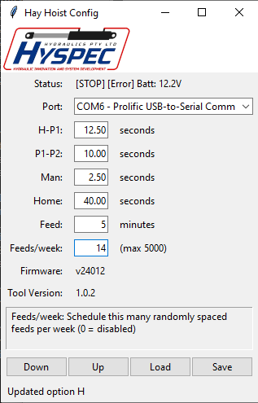

# Hay Hoist Utilities

## hhtool

Read config out of hay hoist and save to config.json:

	$ hhtool.py -r config.json

Write config from config.json to hay hoist:

	$ hhtool.py -w config.json

Read current config and print values to terminal:

	$ hhtool.py
	Firmware = v24012
	H-P1 = 12.50 seconds
	P1-P2 = 15.00 seconds
	Man = 2.50 seconds
	H = 40.00 seconds
	Feed = 30 minutes
	Feeds/week = 28
	[AT H] Batt: 12.2V

## hhconfig

Graphical hay hoist configuration and monitoring application.
